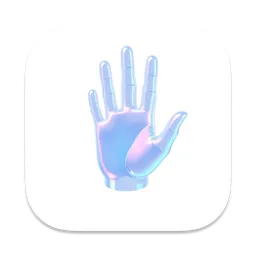

# TrackHands

Stop biting your nails with TrackHands - a macOS app that helps you break the nail-biting habit by detecting when your hands are near your mouth.

[Download from Mac App Store ($4.99)](https://apps.apple.com/us/app/trackhands/id6739174950?mt=12)

## Features

- Real-time hand and face detection using Vision framework
- Unobtrusive menu bar app
- Warning overlay when hands are detected near mouth
- Camera preview with detection visualization
- Adjustable detection frequency
- Configurable camera resolution
- Screenshot capture of detected incidents
- Privacy-focused - no data collection

## Requirements

- macOS 14.2 or later
- Built-in camera or compatible webcam
- Camera permissions enabled

## How It Works

TrackHands runs in your menu bar and uses your Mac's camera to:

1. Detect your face and mouth position
2. Track your hand and finger positions
3. Show a warning overlay when fingers are detected near your mouth
4. Capture a screenshot of the incident to help build awareness

## Privacy

- All processing is done locally on your device
- No data is collected or transmitted
- Camera access is required but footage never leaves your Mac

## Settings

- Adjust check frequency (seconds between detections)
- Configure camera resolution (Low/Medium/High)
- View detection overlay in preview window

## Support

If you're having issues with finger detection:
1. Try quitting and reopening the app
2. If problems persist, contact help@trackhands.com

## License

Contribute and install it on your MacOS! Or just install it from the AppStore :)

## Credits

Developed by Joaquin Ossandon (@cacoos on X)